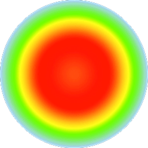
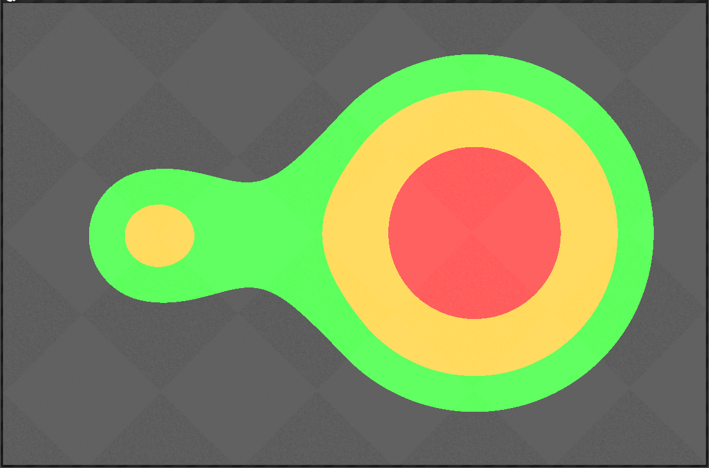

# Heat Map

Heatmap generator for Unreal Engine, where the heatmap is essentially a material for decal projection.

## Demo

## Heat Points

Parameter `heat points` is an Array of `vector3`, standing for array of heat points, every linear color's X,Y,Z channel stands for:

- X: X coordinate in UV space
- Y: Y coordinate in UV space
- Z: radius for this point, in the range of 0.1 ~ 0.5

## X-Axis Scale

Parameter `xScale` is a `scalar` for making a rectangle instead of square, it's value equals to width/height.

## Thresholds

Parameter `thresholds` is a `vector3` standing for how much each color occupy around a heat point, each channel stands for:

- X: threshold between transparent and green (boundary)
- Y: threshold between green and orange (middle)
- Z: threshold between orange and red (center)

## Optimization

To make better visualization of heatmap, turn on flat shading or unlit mode, even orthographic camera can help highlight the heatmap.

## License

[MIT License](./License)